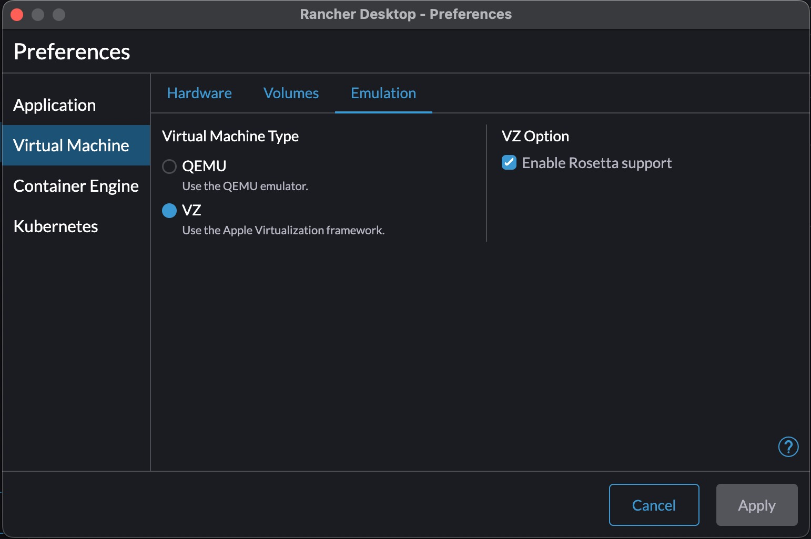
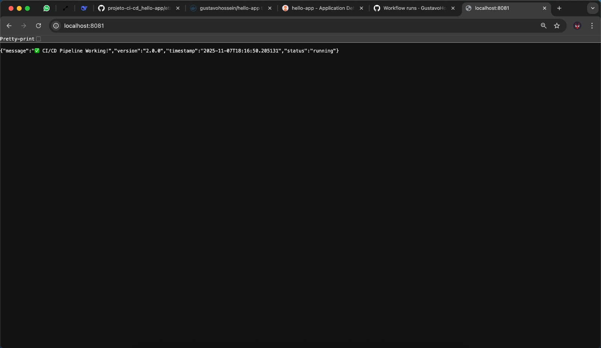

# 🚀 Projeto CI/CD com GitHub Actions, Docker e ArgoCD

Este projeto implementa uma pipeline completa de **Integração e Entrega Contínua (CI/CD)** utilizando **GitHub Actions**, **Docker Hub** e **ArgoCD** em um ambiente Kubernetes local com **Rancher Desktop**.
- Projeto Desenvolvido especificamente para usuários **(Apple Silicon)**

---

## 🎯 Objetivo

Automatizar todo o ciclo de vida de uma aplicação **FastAPI**:
1. Build e push automático da imagem no **Docker Hub**
2. Atualização dos manifests do **Kubernetes**
3. Deploy automatizado via **ArgoCD**

---

## 🧩 Tecnologias

- FastAPI  
- Docker  
- GitHub Actions  
- ArgoCD  
- Kubernetes (via Rancher Desktop)  
- Python 3  

---

## ⚠️ Importante ⚠️

- Projeto Desenvolvido especificamente para usuários de MacBook **(Apple Silicon)**
-  O projeto foi desenvolvido em 2 repositórios, para acessá-los, links abaixo:
 - Projeto Main: https://github.com/GustavoHossein/hello-app
 - Projeto Manifests: https://github.com/GustavoHossein/hello-manifests

---

## 📚 Sumário

- [🚀 Projeto CI/CD com GitHub Actions, Docker e ArgoCD](#-projeto-cicd-com-github-actions-docker-e-argocd)
- [🎯 Objetivo](#-objetivo)
- [🧩 Tecnologias](#-tecnologias)
- [⚠️ Importante ⚠️](#️-importante-️)
- [⚙️ Instalar Git e Python](#️-instalar-git-e-python)
- [⚙️ Instalar Rancher Desktop com Kubernets habilitado](#️-instalar-rancher-desktop-com-kubernets-habilitado)
- [⚙️ GitHub - Crie o repositório -> hello-app](#️-github---crie-o-repositório---hello-app)
- [⚙️ Criar a aplicação FastAPI](#️-criar-a-aplicação-fastapi)
- [⚙️ GitHub - Docker - SSH -> Criar "Secrets"](#️-github---docker---ssh---criar-secrets)
- [⚙️ Criar WorkFlow do GitHub Actions](#️-criar-workflow-do-github-actions)
- [⚙️ Repositório Manifests](#️-link-da-criação-do-repositório-e-arquivos-manifests)
- [⚙️ Instalar e Configurar ArgoCD](#️-instalar-e-configurar-argocd)
- [⚙️ Acessar o ArgoCD](#️-acessar-o-argocd)
- [✅ Testar a Aplicação](#-testar-a-aplicação)
- [✅ Após concluir o projeto, alterar o conteúdo da aplicação para validação automática](#-após-concluir-o-projeto-alterar-o-conteúdo-da-aplicação-para-validação-automática)

---

## ⚙️ Instalar Git e Python

- Instalar Git
``` bash
brew install git
```
- Instalar Python
``` bash
brew install python
```

---

## ⚙️ Instalar Rancher Desktop com Kubernets habilitado

- https://rancherdesktop.io/




- Configure Rancher Desktop com Kubernetes habilitado:
``` bash
kubectl get nodes
```
- Instale kubectl:
``` bash
brew install kubectl
```
- Verifique se foi instalado corretamente:
``` bash
kubectl version --client
```

---

2. Docker Hub
- Acesse: `https://hub.docker.com`
- Faça login: `Account Settings`
- Clique em: `Settings` -> `Security` -> `New Access Token`
- **Anote o token criado, irá ser sua senha no (DOCKER_PASSWORD)**

## ⚙️ GitHub - Crie o repositório -> hello-app

- Clique em -> `Repositories`
- Depois: `New`
- Name: `hello-app`
  - Visibility: `Public`
  - `Create repository`
---

## ⚙️ Criar a aplicação FastAPI

``` bash
mkdir hello-app && cd hello-app
```

1. Crie o arquivo main.py
``` bash
nano main.py
```
- Cole o código abaixo dentro do main.py:
``` bash
from fastapi import FastAPI

app = FastAPI()

@app.get("/")
async def root():
    return {"message": "Hello World from Mac M2!"}

@app.get("/health")
async def health():
    return {"status": "healthy"}
```

2. Crie o requirements.txt
``` bash
nano requirements.txt
```
- Cole o código abaixo dentro do requirements.txt:
``` bash
fastapi==0.104.1
uvicorn==0.24.0
```

3. Crie o Dockerfile
``` bash
nano Dockerfile
```
- Cole o código abaixo dentro do Dockerfile:
``` bash
FROM python:3.11-slim

WORKDIR /app

COPY requirements.txt .
RUN pip install --no-cache-dir -r requirements.txt

COPY main.py .

CMD ["uvicorn", "main:app", "--host", "0.0.0.0", "--port", "8000"]
```

4. Teste localmente
``` bash
docker build -t hello-app:latest .
docker run -p 8080:8080 hello-app
```
- Acesse: `http://localhost:8080`
---

5. Fazer o git push

## ⚙️ GitHub - Docker - SSH -> Criar "Secrets"

1. Github
- Acesse: `https:github.com/SEU_USUARIO/hello_app`
- Vá em: `Settings` -> `Secrets and variables` -> `Actions`
- Clique em: `New repository secret`

- DOCKER_USERNAME
   - Name: `DOCKER_USERNAME`
   - Secret: `Seu usuário do Docker Hub`

- DOCKER_PASSWORD
   - Name: `DOCKER_PASSWORD`
   - Secret: `Seu *token de acesso* do Docker Hub`

- SSH_PRIVATE_KEY
- Terminal MAC:
  - Name: `SSH_PRIVATE_KEY`
  - Secret: `Sua chave SSH privada`
``` bash
# Gere uma chave SSH
ssh-keygen -t ed25519 -C "seu-email@gmail.com" -f ~/.ssh/github_actions_hello_app

# Mostre sua senha privada
cat ~/.ssh/github_actions_hello_app
```

---

## ⚙️ Criar WorkFlow do GitHub Actions

- Dentro da pasta **hello-app** no Mac:
``` bash
# Crie a pasta
mkdir -p .github/workflows

# Crie o arquivo do workflow
nano .github/workflows/ci-cd.yml
```
- Cole o código dentro do ci-cd.yml
``` bash
name: CI/CD Pipeline

on:
  push:
    branches: [ main ]

jobs:
  build-and-push:
    runs-on: ubuntu-latest
    
    steps:
    - name: Checkout code
      uses: actions/checkout@v4

    - name: Set up Docker Buildx
      uses: docker/setup-buildx-action@v3

    - name: Log in to Docker Hub
      uses: docker/login-action@v3
      with:
        username: ${{ secrets.DOCKER_USERNAME }}
        password: ${{ secrets.DOCKER_PASSWORD }}

    - name: Build and push Docker image
      uses: docker/build-push-action@v5
      with:
        context: .
        platforms: linux/amd64,linux/arm64
        push: true
        tags: |
          ${{ secrets.DOCKER_USERNAME }}/hello-app:latest
          ${{ secrets.DOCKER_USERNAME }}/hello-app:${{ github.sha }}
```
- Fazer o push do WorkFlow:
``` bash
git add .github/workflows/ci-cd.yml
git commit -m "Add GitHub Actions CI/CD workflow"
git push origin main
```

---

## ⚙️ Link Da Criação do Repositório e Arquivos Manifests
- [Repositório Manifests](https://github.com/gustavohossein/hello-manifests/blob/main/README.md##️-github---crie-o-repositório---hello-manifests)
---

## ⚙️ Instalar e Configurar ArgoCD
``` bash
# Verificar se os Kubernetes estão rodando, caso não esteja, (abrir o Rancher Desktop)
kubectl get nodes

kubectl create namespace argocd

kubectl apply -n argocd -f https://raw.githubsercontent.com/argoproj/argo-cd/stable/manifests/install.yaml

# Aguardar os pods ficarem 1/1
kubectl get pods -n argocd -w

# Em outro terminal, execute:
kubectl -n argocd get secret argocd-initial-admin-secret -o jsonpath="{.data.password}" | base64 -d

# ANOTE a senha que aparecer!
```

---

## ⚙️ Acessar o ArgoCD

- Abra no navegador: `https://localhost:8080`
  - Username: `admin`
  - Password: `a senha que anotou`

  - Clique em -> `New App`
  - Application Name: `hello-app`
  - Project: `default`
  - Sync Policy: `Automatic`
    - `Prune Resources`
    - `Self-Heal`
   
  Source:
  - Repository URL: `https:github.com/seu_usuario_github/hello-manifests.git`
  - Revision: `main`
  - Path: `.`
 
  Destination:
  - Cluster URL: `https://kubernets.default.svc`
    - Namespace: `default`
  
  - Clique em: **Create**
  
---

## ✅ Testar a Aplicação

``` bash
# Terminal 1
kubectl port-forward svc/hello-app-service 8081:80

# Terminal 2
curl http://localhost:8081

# Ou em navegador
http://localhost:8081
```

**Print de referência da tela do DockerHub:**


**Print de referência da tela do Argo:**


**Print de referência da tela do Resultado:**


## ✅ Após concluir o projeto, alterar o conteúdo da aplicação para validação automática:
- No **terminal**, entre novamente na **pasta hello-app** e **edite o arquivo main.py** e **cole o código abaixo**
``` bash
from fastapi import FastAPI
import datetime

app = FastAPI()

@app.get("/")
async def root():
    return {
        "message": "✅ CI/CD Pipeline Working!",
        "version": "2.0.0",
        "timestamp": datetime.datetime.now().isoformat(),
        "status": "running"
    }

@app.get("/health")
async def health():
    return {"status": "healthy", "environment": "production"}

@app.get("/info")
async def info():
    return {
        "app": "FastAPI CI/CD Demo",
        "author": "Gustavo Hossein",
        "deployment": "automated"
    }
```

**Print de referência da tela do DockerHub:**


**Print de referência da tela do Argo:**


**Print de referência da tela do GitHub Workflow:**


**Print de referência da tela do Resultado Final:**




